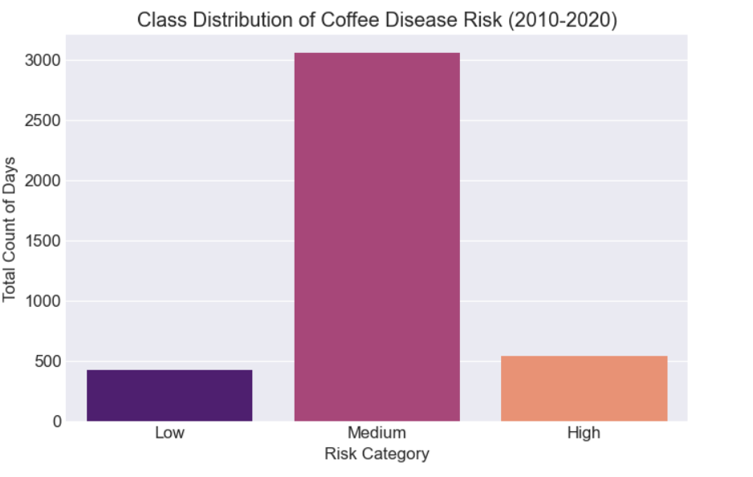
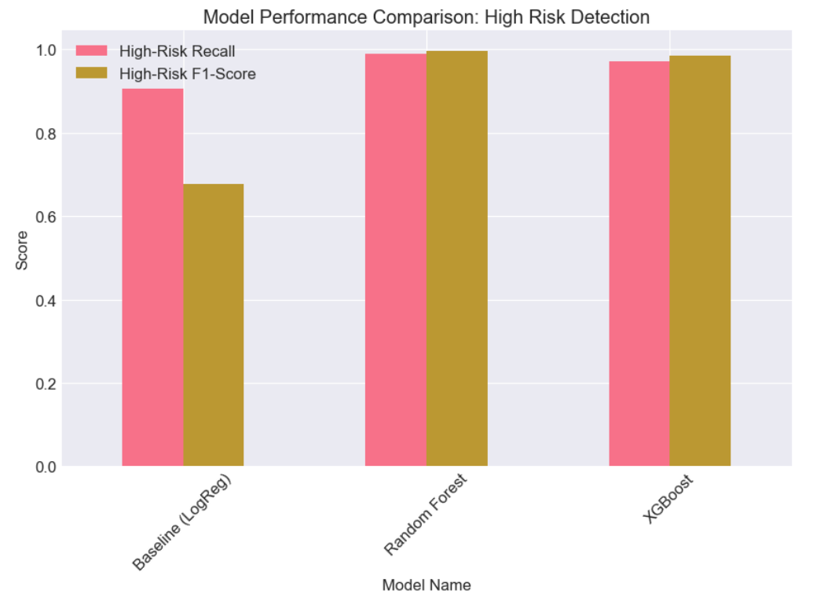

# Model to Predict Coffee Disease Risk for Proactive Farm Management  

### DSPT-12(Group 8)

**Project Date:** January 2026  

## Team Members
- June Masolo  
- Catherine Kaino  
- Joram Lemaiyan  
- Kennedy Omoro  
- Kigen Tuwei  
- Hellen Khisa  
- Alvin Ngeno  

---

## Project Overview

This project entails building a supervised machine learning model to predict the risk level of coffee leaf rust disease outbreaks. The model classifies upcoming risk as Low, Medium, or High using environmental and historical data, enabling farmers to apply fungicides or pesticides proactively and only when necessary. The approach focuses on key drivers such as weather patterns, historical pest incidence, and crop growth stages to forecast disease probability in coffee crops. The model is trained using meteorological data, including temperature, humidity, and rainfall, obtained from the NASA POWER API (https://power.larc.nasa.gov/), which is tailored for agricultural modeling. Several predictive classification models are employed, including Logistic Regression as the baseline model, Decision Tree and Random Forest models, and Gradient Boosting (XGBoost), to assign disease risk levels. Model performance is evaluated using precision, recall, F1-score, and overall multi-class accuracy, with strong emphasis on the interpretability and practical usefulness of the risk categories for real-world decision-making.

---

## 1. Business Problem

Coffee production in Kenya is increasingly threatened by unpredictable disease outbreaks such as **Coffee Leaf Rust**, which can reduce smallholder yields by up to **70%** and lead to significant financial instability.

Current disease management practices are largely **reactive**:
- Farmers wait for visible symptoms when it is often too late  
- Others apply fungicides indiscriminately as a precaution  
- This leads to:
  - High production costs  
  - Reduced profitability  
  - Environmental degradation  

There is therefore a **critical need for a data-driven early warning system** that leverages environmental data to provide **timely, accurate, and actionable risk predictions**, enabling farmers to spray only when necessary.

**Objectives**

1.Develop a model for proactive prediction of coffee leaf rust disease risk

2.Classify disease risk into Low, Medium, and High to guide appropriate farmer action

3.Help farmers reduce unnecessary chemical input costs by supporting efficient fungicide use

4.Minimize environmental impact while protecting crop yields and livelihoods

---

## 2. Data Understanding
This project follows the **CRISP-DM (Cross Industry Standard Process for Data Mining)** framework to ensure a structured and rigorous data science workflow.

**Data Source:**  
Data was obtained from the **NASA POWER API**, providing high-quality agro-meteorological datasets suitable for climate-sensitive applications.

**Data Period:** 01-01-2010 to 31-12-2020  
**Geographical Focus:** Nyeri County, Kenya (a major coffee-growing zone)  
**Data Type:** Daily weather observations relevant to plant disease development  

The dataset was selected because environmental variables such as **temperature, humidity, rainfall, and wind speed** are scientifically linked to fungal disease outbreaks. These variables serve as the **primary features** for model prediction.

**Imports & Environment Setup:**  
The project environment was configured using standard Python data science libraries for:

- Data manipulation (`pandas`, `numpy`)  
- Visualization (`matplotlib`, `seaborn`)  
- Exploratory data analysis  
- Machine learning modeling (`scikit-learn`, `xgboost`, `joblib`)  

---

## Exploratory Data Analysis (EDA)

Exploratory analysis was conducted to understand the structure, quality, and behavior of the data before modeling.

Logical validation checks were performed to ensure the data values were physically realistic for the Nyeri region:

- Maximum temperature detected: **21.02°C**  
- Minimum temperature detected: **11.91°C**  
- Maximum humidity detected: **93.19%**

**Univariate analysis was conducted on the four core weather variables used in the project:**
- Temperature (T2M)  
- Relative Humidity (RH2M)  
- Rainfall (PRECTOTCORR)  
- Wind Speed (WS2M)  

Histograms were used to assess:Distribution shapes,Presence of outliers,Environmental patterns and  Normality characteristics  

**Visualizing Weather Patterns in Nyeri (2010–2020)**

The plots below illustrate the distributions of the four climate variables used in the model.

*Figure: Distribution of temperature, humidity, rainfall, and wind speed in Nyeri (2010–2020).*
** Key Insights from the Analysis**

**Temperature (T2M)**-Temperatures are relatively stable throughout the period, mostly ranging between 14°C and 19°C, providing conditions that are optimal for coffee growth but also favorable for fungal development.

**Humidity (RH2M)**-The humidity distribution is left-skewed, with most days between 75% and 90%, confirming that Nyeri provides an environment highly conducive to disease outbreaks.

**Rainfall (PRECTOTCORR)**-The rainfall distribution shows strong zero-inflation, with many days having no rain while rare but heavy events reaching up to 70mm per day, confirming that moisture availability is episodic yet critical for triggering disease risk.

**Wind Speed (WS2M)**-Wind speeds are generally moderate, centered around 2.0–2.5 m/s, with very few extreme events above 4.0 m/s, supporting later findings that wind contributes minimally to disease prediction

**Dataset Summary**
The final dataset used for modeling consisted of:
- **Rows:** 4,018  
- **Columns:** 4  
- **Missing Values:** None  
This confirms that the dataset is **clean, complete, and suitable for machine learning modeling**.

---

## 3. Data Preparation & Feature Engineering

Data preparation for this project involved transforming the raw weather data into a structured format suitable for predictive modeling. This included column renaming, mapping crop stages based on date, and creating a target variable for disease risk using agronomic rules. In Kenya, coffee exhibits clear seasonality: the Flowering stage typically occurs after the onset of rains, around March/April and October/November. Disease risk is not solely determined by weather; plants are more vulnerable during the Flowering and Early Cherry stages than during pruning.

To generate the target variable, "Risk Level," agronomic rules were applied based on scientific research on Coffee Leaf Rust (CLR). The fungus *Hemileia vastatrix* thrives under specific conditions: temperatures between 15°C and 30°C (optimal 21°C–25°C), relative humidity exceeding 90% for at least 24–48 hours, and moderate rainfall sufficient to splash spores but not so heavy as to wash them away completely. Each day in the dataset was labeled as Low, Medium, or High risk based on these conditions, providing a reliable basis for supervised learning.

Examining the proportions of the Risk Label reveals a moderate class imbalance:

| RiskLabel(Target) | Proportion |
|-----------------|------------|
| Medium          | 0.761      |
| High            | 0.134      |
| Low             | 0.106      |

This output indicates that a naïve model predicting only "Medium" could achieve roughly 76% accuracy, but would fail to detect High Risk outbreaks, which are critical for farmers. Missing a High Risk day has significant business impact, making overall accuracy insufficient as a metric.

Algorithms like Random Forest and XGBoost naturally aim to minimize total error, prioritizing the most frequent class—in this case, "Medium"—at the expense of High and Low classes. To mitigate this, strategies such as using F1-Score, Precision, and Recall for High and Low classes, applying class weighting (`class_weight='balanced'`), and employing resampling techniques like SMOTE (Synthetic Minority Over-sampling Technique) will be applied during modeling.

The class imbalance is visually represented in the bar chart below, showing the number of days labeled Low, Medium, and High from 2010 to 2020:

As noted, there are approximately 3,000 "Medium" days and around 500 "High" days. This confirms the need for class weighting during modeling, ensuring that missing one High Risk day is treated as far more severe than missing one Medium Risk day.

After addressing the class distribution, lagged features were created to account for the disease incubation period and to enable early warning predictions. Research indicates that the lag between conducive weather (high humidity or rainfall) and measurable CLR outbreaks ranges from 15 to 30 days, with early warning systems often using 8 to 15 days. In this project, a 14-day lag was applied to the key weather variables: average temperature, humidity, rainfall, and wind speed. Additionally, 14-day rolling averages were calculated to capture sustained environmental conditions, such as prolonged high humidity, which have a stronger effect on disease risk than single-day events. This lagging ensures that the model can anticipate outbreaks before they are visible in the field.  

The final processed dataset includes the original weather variables, crop stage, month, the Risk Label target, lagged weather variables, and rolling averages. A sample of the processed data shows the relationship between lagged humidity values, rolling averages, and the target Risk Label:

| Date       | RiskLabel(Target) | Humidity(%)_Lag14 | Humidity(%)_Avg_Last14Days |
|------------|-----------------|-----------------|----------------------------|
| 2010-01-15 | Medium          | 86.57           | 78.30                     |
| 2010-01-16 | Medium          | 89.25           | 77.43                     |
| 2010-01-17 | Medium          | 85.61           | 76.35                     |
| 2010-01-18 | Medium          | 85.22           | 75.62                     |
| 2010-01-19 | Medium          | 78.20           | 74.39                     |

This confirms that the dataset now reflects **real-world temporal causality**, allowing the model to generate **practical early warnings** rather than merely explaining historical patterns.

---

## 4. Modelling

To predict Coffee Leaf Rust (CLR) risk, three classification models were implemented: Logistic Regression as a baseline, Random Forest as a robust ensemble method, and XGBoost for gradient boosting optimization.  

The target variable, `RiskLabel(Target)`, was encoded numerically (Low → 0, Medium → 1, High → 2), and features included all lagged and rolling weather variables along with the engineered Crop Stage. Date and original target columns were excluded to prevent data leakage.  

The dataset was split into training and testing sets using an 80:20 ratio with stratification, ensuring that the minority High Risk class was represented in both sets for accurate evaluation.  

Numerical features were standardized, and Crop Stage was encoded to be compatible with the models. Class weighting was applied to account for the moderate class imbalance, ensuring that High Risk days received appropriate importance during training.  

This setup allows a direct comparison between the baseline Logistic Regression and the ensemble models. Random Forest and XGBoost are expected to better capture non-linear interactions between weather variables, rolling averages, lagged features, and Crop Stage, thereby improving recall and F1-score for the critical High Risk category. This is particularly important for farmers, as correctly predicting High Risk days enables timely interventions to prevent disease outbreaks.
## 5. Model Evaluation

Three models were evaluated for predicting coffee disease risk: Logistic Regression (baseline), Random Forest, and XGBoost. Model performance was assessed using overall accuracy together with precision, recall, and F1-score for the High-Risk class, since correctly identifying High-Risk outbreaks is the most important requirement for an effective early warning system.

The initial evaluation showed that Logistic Regression achieved an accuracy of 71.9%, with strong High-Risk recall (90.7%) but weaker precision (54.2%), meaning it detects most outbreaks but generates many false alarms. Random Forest and XGBoost achieved extremely high scores, with accuracy and precision above 99% and High-Risk recall above 97%. While these results appear impressive, such near-perfect performance is unrealistic in practical machine learning tasks and strongly suggested the presence of overfitting, where models memorize patterns rather than learn generalizable relationships.

To confirm this, training and testing performance were compared. Random Forest and XGBoost achieved 100% accuracy on the training data and approximately 99.5% on the test data, which reinforced concerns about overfitting. Feature importance analysis showed that rainfall, temperature, humidity, and their 14-day lagged and rolling average features dominated the models’ decisions, which is biologically meaningful for coffee leaf rust, but also highlighted that tree-based models were overfitting due to excessive model complexity rather than data leakage.

To address this issue, regularization was applied to constrain model complexity. After adjustment, the models produced more realistic and reliable performance. Logistic Regression remained stable at around 72% accuracy, XGBoost achieved approximately 76% accuracy, and the regularized Random Forest achieved the best performance with 85% accuracy and a small train–test gap, indicating good generalization. Most importantly, the Random Forest model achieved approximately 98% recall for High-Risk outbreaks, making it highly suitable for use as a farmer-focused early warning system.

The model performance comparison for High-Risk Recall and F1-Score is shown below.

Based on both statistical performance and practical usefulness, the regularized Random Forest model was selected as the final model. Although it may generate occasional false alerts, it minimizes the risk of missing serious outbreaks, which is the most critical requirement in real-world agricultural decision-making.

## 6. Deployment

The final trained model was saved and prepared for deployment so that it can be used in a real-world application. The goal of deployment is to make the system practical for farmers and extension officers, not just technically accurate.

The application is designed so that the user only needs to provide four main weather variables: temperature, rainfall, humidity, and wind speed. All other engineered features such as lagged values and rolling averages are automatically generated in the background by the system. This ensures that the app remains simple and user-friendly while still benefiting from the more complex feature engineering used during model training.

This design choice was intentional because requiring users to manually input many technical values such as 14-day averages would make the system difficult to use and reduce adoption. By keeping the input simple, the tool becomes more realistic for real-world agricultural use.

The deployed application can be accessed here:

### Conclusion
The project successfully developed a Predictive Early Warning System for Coffee Leaf Rust using a Random Forest Classifier. The model achieved a 98% Recall for high-risk outbreaks, significantly outperforming the baseline Logistic Regression at 91%. The analysis identifies Rainfall as the leading indicator of risk, followed by Temperature and Humidity, suggesting that moisture availability is the critical catalyst for fungal development in the Nyeri region.
This means farmers can trust the system to only recommend spraying when it is absolutely necessary, saving both the crop and their money."

Observation: Wind Speed showed negligible feature importance.

Interpretation: The disease is "moisture-driven" rather than "dispersal-limited."

Action: Future versions of the model could potentially exclude wind data to simplify the sensor array without losing accuracy.

Next Steps:
Final comparison table

| Model | Best For... | Business Impact |
| :--- | :--- | :--- |
| **LogReg** | Simplicity | High safety (Recall), but expensive (False Positives). |
| **Random Forest** | **Safety (Recall)** | **The "Farmer's Choice":** Almost never misses an outbreak. |

- Observation: Wind Speed showed negligible feature importance.

- Interpretation: The disease is "moisture-driven" rather than "dispersal-limited."

- Action: Future versions of the model could potentially exclude wind data to simplify the sensor array without losing accuracy.
