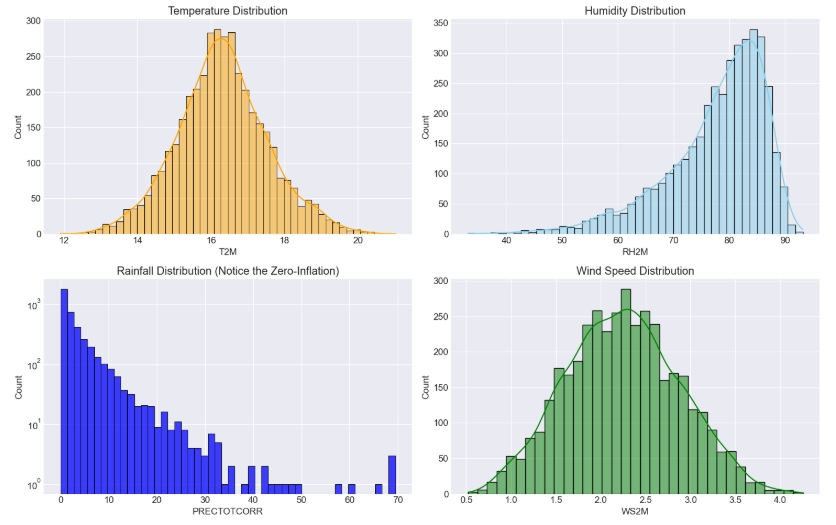

# Model to Predict Coffee Disease Risk for Proactive Farm Management  

### DSPT-12(Group 8)

**Project Date:** January 2026  

## Team Members
- June Masolo  
- Catherine Kaino  
- Joram Lemaiyan  
- Kennedy Omoro  
- Kigen Tuwei  
- Hellen Khisa  
- Alvin Ngeno  

---

## Project Overview

This project entails building a supervised machine learning model to predict the risk level of coffee leaf rust disease outbreaks. The model classifies upcoming risk as Low, Medium, or High using environmental and historical data, enabling farmers to apply fungicides or pesticides proactively and only when necessary. The approach focuses on key drivers such as weather patterns, historical pest incidence, and crop growth stages to forecast disease probability in coffee crops. The model is trained using meteorological data, including temperature, humidity, and rainfall, obtained from the NASA POWER API (https://power.larc.nasa.gov/), which is tailored for agricultural modeling. Several predictive classification models are employed, including Logistic Regression as the baseline model, Decision Tree and Random Forest models, and Gradient Boosting (XGBoost), to assign disease risk levels. Model performance is evaluated using precision, recall, F1-score, and overall multi-class accuracy, with strong emphasis on the interpretability and practical usefulness of the risk categories for real-world decision-making.


---

## 1. Business Problem

Coffee production in Kenya is increasingly threatened by unpredictable disease outbreaks such as **Coffee Leaf Rust**, which can reduce smallholder yields by up to **70%** and lead to significant financial instability.

Current disease management practices are largely **reactive**:
- Farmers wait for visible symptoms when it is often too late  
- Others apply fungicides indiscriminately as a precaution  
- This leads to:
  - High production costs  
  - Reduced profitability  
  - Environmental degradation  

There is therefore a **critical need for a data-driven early warning system** that leverages environmental data to provide **timely, accurate, and actionable risk predictions**, enabling farmers to spray only when necessary.

**Objectives**

1.Develop a model for proactive prediction of coffee leaf rust disease risk

2.Classify disease risk into Low, Medium, and High to guide appropriate farmer action

3.Help farmers reduce unnecessary chemical input costs by supporting efficient fungicide use

4.Minimize environmental impact while protecting crop yields and livelihoods

---

## 2. Data Understanding
This project follows the **CRISP-DM (Cross Industry Standard Process for Data Mining)** framework to ensure a structured and rigorous data science workflow.

**Data Source:**  
Data was obtained from the **NASA POWER API**, providing high-quality agro-meteorological datasets suitable for climate-sensitive applications.

**Data Period:** 01-01-2010 to 31-12-2020  
**Geographical Focus:** Nyeri County, Kenya (a major coffee-growing zone)  
**Data Type:** Daily weather observations relevant to plant disease development  

The dataset was selected because environmental variables such as **temperature, humidity, rainfall, and wind speed** are scientifically linked to fungal disease outbreaks. These variables serve as the **primary features** for model prediction.

**Imports & Environment Setup:**  
The project environment was configured using standard Python data science libraries for:

- Data manipulation (`pandas`, `numpy`)  
- Visualization (`matplotlib`, `seaborn`)  
- Exploratory data analysis  
- Machine learning modeling (`scikit-learn`, `xgboost`, `joblib`)  

---

## Exploratory Data Analysis (EDA)

Exploratory analysis was conducted to understand the structure, quality, and behavior of the data before modeling.

Logical validation checks were performed to ensure the data values were physically realistic for the Nyeri region:

- Maximum temperature detected: **21.02°C**  
- Minimum temperature detected: **11.91°C**  
- Maximum humidity detected: **93.19%**

**Univariate analysis was conducted on the four core weather variables used in the project:**
- Temperature (T2M)  
- Relative Humidity (RH2M)  
- Rainfall (PRECTOTCORR)  
- Wind Speed (WS2M)  

Histograms were used to assess:Distribution shapes,Presence of outliers,Environmental patterns and  Normality characteristics  

**Visualizing Weather Patterns in Nyeri (2010–2020)**

The plots below illustrate the distributions of the four climate variables used in the model.

### Univariate Weather Analysis



*Figure: Distribution of temperature, humidity, rainfall, and wind speed in Nyeri (2010–2020).*
** Key Insights from the Analysis**

**Temperature (T2M)**-Temperatures are relatively stable throughout the period, mostly ranging between 14°C and 19°C, providing conditions that are optimal for coffee growth but also favorable for fungal development.

**Humidity (RH2M)**-The humidity distribution is left-skewed, with most days between 75% and 90%, confirming that Nyeri provides an environment highly conducive to disease outbreaks.

**Rainfall (PRECTOTCORR)**-The rainfall distribution shows strong zero-inflation, with many days having no rain while rare but heavy events reaching up to 70mm per day, confirming that moisture availability is episodic yet critical for triggering disease risk.

**Rainfall (PRECTOTCORR)**
- The rainfall distribution exhibits strong **zero-inflation** (many days with no rain).
- Heavy rainfall events are rare but significant, reaching up to **70mm per day**.
- This confirms that **moisture availability is episodic but critical** in triggering disease risk.

**Wind Speed (WS2M)**
- Wind speeds are generally moderate, centered around **2.0–2.5 m/s**.
- Very few extreme wind events (>4.0 m/s) are observed.
- This supports later modeling findings that wind contributes minimally to disease prediction.

---

### Correlation Between Weather Variables


## Dataset Summary
**Wind Speed (WS2M)**-Wind speeds are generally moderate, centered around 2.0–2.5 m/s, with very few extreme events above 4.0 m/s, supporting later findings that wind contributes minimally to disease predictio

**Dataset Summary**
The final dataset used for modeling consisted of:
- **Rows:** 4,018  
- **Columns:** 4  
- **Missing Values:** None  
This confirms that the dataset is **clean, complete, and suitable for machine learning modeling**.

---
## 4. Data Preparation & Feature Engineering

A rigorous data preparation process was undertaken to transform the raw weather data into a format suitable for predictive modeling. This step is critical in ensuring that the model reflects **real agronomic behavior** rather than purely statistical patterns.

### 4.1 Domain-Driven Feature Design

Rather than relying solely on statistical transformations, this project incorporated **agronomic knowledge** to guide feature construction. The preparation process involved:

- Column renaming for clarity and interpretability  
- Date-based mapping of coffee crop stages  
- Rule-based construction of the **target variable (Risk Label)**  
- Time-aware feature engineering using **lagged variables** and **rolling averages**  

This ensured that the model remained **scientifically grounded and contextually meaningful**.

---

## 4.2 Target Variable Construction (Risk Label)

To build a supervised machine learning model, a target variable was required. Since labeled disease outbreak data was unavailable, the dataset was labeled using **agronomic rules commonly used by plant pathologists**.

### Agronomic Basis for Risk Labeling

Research on **Coffee Leaf Rust (Hemileia vastatrix)** indicates that outbreaks are most likely when:

- **Temperature:** between **15°C and 30°C**  
  - Optimal range: **21°C – 25°C**  
- **Relative Humidity:** sustained above **90%** for 24–48 hours  
- **Rainfall:** present (to facilitate spore dispersal), but not excessively heavy  

Additionally, disease susceptibility varies by **crop growth stage**. In Kenya, coffee plants are most vulnerable during:
- **Flowering stage** (March–April and October–November)  
- **Early cherry development stage**  

Using these scientifically grounded conditions, a rule-based logic was applied to generate the target column:

> **Risk Label (Target):** Low, Medium, or High risk of disease outbreak

This approach ensures that the model predictions are **biologically meaningful and practically interpretable**.


### Visual Check of Rule-Based Labels


---

## 4.3 Temporal Feature Engineering (Lagging and Rolling Averages)

A key limitation of naive models is that they treat weather and disease risk as occurring simultaneously. In reality, there is a **biological delay (incubation period)** between conducive weather conditions and visible disease symptoms.

### Scientific Motivation

For Coffee Leaf Rust in East Africa:
- Reported incubation lag ranges between **15–30 days**  
- Early warning systems often use a shorter operational lag of **8–15 days**  

Based on this evidence, this project implemented a **14-day predictive lag window**, enabling the model to function as a true **forecasting system** rather than a reactive classifier.

---
## 3. Data Preparation & Feature Engineering

Data preparation for this project involved transforming the raw weather data into a structured format suitable for predictive modeling. This included column renaming, mapping crop stages based on date, and creating a target variable for disease risk using agronomic rules. In Kenya, coffee exhibits clear seasonality: the Flowering stage typically occurs after the onset of rains, around March/April and October/November. Disease risk is not solely determined by weather; plants are more vulnerable during the Flowering and Early Cherry stages than during pruning.

To generate the target variable, "Risk Level," agronomic rules were applied based on scientific research on Coffee Leaf Rust (CLR). The fungus *Hemileia vastatrix* thrives under specific conditions: temperatures between 15°C and 30°C (optimal 21°C–25°C), relative humidity exceeding 90% for at least 24–48 hours, and moderate rainfall sufficient to splash spores but not so heavy as to wash them away completely. Each day in the dataset was labeled as Low, Medium, or High risk based on these conditions, providing a reliable basis for supervised learning.

Examining the proportions of the Risk Label reveals a moderate class imbalance:

| RiskLabel(Target) | Proportion |
|-----------------|------------|
| Medium          | 0.761      |
| High            | 0.134      |
| Low             | 0.106      |

This output indicates that a naïve model predicting only "Medium" could achieve roughly 76% accuracy, but would fail to detect High Risk outbreaks, which are critical for farmers. Missing a High Risk day has significant business impact, making overall accuracy insufficient as a metric.

Algorithms like Random Forest and XGBoost naturally aim to minimize total error, prioritizing the most frequent class—in this case, "Medium"—at the expense of High and Low classes. To mitigate this, strategies such as using F1-Score, Precision, and Recall for High and Low classes, applying class weighting (`class_weight='balanced'`), and employing resampling techniques like SMOTE (Synthetic Minority Over-sampling Technique) will be applied during modeling.

The class imbalance is visually represented in the bar chart below, showing the number of days labeled Low, Medium, and High from 2010 to 2020:


As noted, there are approximately 3,000 "Medium" days and around 500 "High" days. This confirms the need for class weighting during modeling, ensuring that missing one High Risk day is treated as far more severe than missing one Medium Risk day.

After addressing the class distribution, lagged features were created to account for the disease incubation period and to enable early warning predictions. Research indicates that the lag between conducive weather (high humidity or rainfall) and measurable CLR outbreaks ranges from 15 to 30 days, with early warning systems often using 8 to 15 days. In this project, a 14-day lag was applied to the key weather variables: average temperature, humidity, rainfall, and wind speed. Additionally, 14-day rolling averages were calculated to capture sustained environmental conditions, such as prolonged high humidity, which have a stronger effect on disease risk than single-day events. This lagging ensures that the model can anticipate outbreaks before they are visible in the field.  

The final processed dataset includes the original weather variables, crop stage, month, the Risk Label target, lagged weather variables, and rolling averages. A sample of the processed data shows the relationship between lagged humidity values, rolling averages, and the target Risk Label:

| Date       | RiskLabel(Target) | Humidity(%)_Lag14 | Humidity(%)_Avg_Last14Days |
|------------|-----------------|-----------------|----------------------------|
| 2010-01-15 | Medium          | 86.57           | 78.30                     |
| 2010-01-16 | Medium          | 89.25           | 77.43                     |
| 2010-01-17 | Medium          | 85.61           | 76.35                     |
| 2010-01-18 | Medium          | 85.22           | 75.62                     |
| 2010-01-19 | Medium          | 78.20           | 74.39                     |

A sample of the final engineered dataset is shown below:

| Date       | Risk Label (Target)  | Humidity (%)_Lag14 | Humidity (%)_Avg_Last14Days  |
|------------|----------------------|--------------------|------------------------------|
| 2010-01-15 | Medium               | 86.57              | 78.30                        |
| 2010-01-16 | Medium               | 89.25              | 77.43                        |
| 2010-01-17 | Medium               | 85.61              | 76.35                        |
| 2010-01-18 | Medium               | 85.22              | 75.62                        |
| 2010-01-19 | Medium               | 78.20              | 74.39                        |

This confirms that the dataset now reflects **real-world temporal causality**, allowing the model to generate **practical early warnings** rather than merely explaining historical patterns.

---

# 5. Modelling

This section sets up the supervised learning pipeline, defines the train–test split with stratification, and compares multiple algorithms (Logistic Regression, Random Forest, XGBoost) using a consistent preprocessing framework.

The main goal is to predict the multi-class target `RiskLabel(Target)` (Low, Medium, High) while handling class imbalance and avoiding data leakage through careful preprocessing and pipeline design.

## Class Distribution


## 5.1 Preparing X and y

The first step is to select the input features (weather and crop stage) and encode the target into numeric form using the mapping **{"Low": 0, "Medium": 1, "High": 2}**.

This preserves the ordinal meaning of the classes while making them compatible with scikit-learn models and metrics.

```python
# Define features and target
feature_cols = ["Temp(Avg)", "Humidity(%)", "Rainfall(mm)", "WindSpeed(m/s)", "CropStage"]
target_col = "RiskLabel(Target)"

X = df_final[feature_cols].copy()
y = df_final[target_col].copy()

# Encode target: Low=0, Medium=1, High=2
risk_mapping = {"Low": 0, "Medium": 1, "High": 2}
y_encoded = y.map(risk_mapping)

print("Class distribution (encoded):")
print(y_encoded.value_counts())

```
## 5.2 Train–Test Split with Stratification

The dataset is split into training and testing sets using train_test_split, with stratify=y_encoded to preserve the class distribution across Low, Medium, and High in both splits.

This is important because disease risk classes are imbalanced and a non-stratified split could produce unrealistic performance estimates.

```python
X_train, X_test, y_train, y_test = train_test_split(
    X,
    y_encoded,
    test_size=0.2,
    random_state=42,
    stratify=y_encoded
)

print("Train shape:", X_train.shape)
print("Test shape:", X_test.shape)
print("Train target distribution:")
print(y_train.value_counts(normalize=True))
print("Test target distribution:")
print(y_test.value_counts(normalize=True))

```
## 5.3 Handling Class Imbalance with Class Weights

Because some risk categories are less frequent, the notebook computes balanced class weights and uses them in models that support class_weight, especially Logistic Regression and Random Forest.

This up-weights minority classes, reducing the tendency of the model to focus only on the majority (e.g., Low risk) class.

```python
classes = np.unique(y_train)
class_weights = compute_class_weight(
    class_weight="balanced",
    classes=classes,
    y=y_train
)
class_weight_dict = dict(zip(classes, class_weights))

print("Computed class weights:", class_weight_dict)

# Optional: save class weights for later reuse
with open("class_weights.pkl", "wb") as f:
    pickle.dump(class_weight_dict, f)

```
## 5.4 Preprocessing and Pipeline Setup

The notebook uses a ColumnTransformer to apply different transformations to numeric and categorical features before feeding them to the models.

Numeric features are standardised using StandardScaler, and the categorical CropStage is encoded with OrdinalEncoder, then all steps are wrapped inside a scikit-learn Pipeline.

```python
from sklearn.compose import ColumnTransformer
from sklearn.preprocessing import OrdinalEncoder

numeric_features = ["Temp(Avg)", "Humidity(%)", "Rainfall(mm)", "WindSpeed(m/s)"]
categorical_features = ["CropStage"]

numeric_transformer = StandardScaler()
categorical_transformer = OrdinalEncoder()

preprocessor = ColumnTransformer(
    transformers=[
        ("num", numeric_transformer, numeric_features),
        ("cat", categorical_transformer, categorical_features)
    ]
)

```
## 5.5 Model Definitions

Multiple models are defined in a models dictionary so they can be trained and evaluated in a uniform loop.

The dictionary includes a baseline Logistic Regression, a RandomForestClassifier, and an XGBClassifier, each with its own hyperparameters and the use of class_weight="balanced" where supported.

```python
from xgboost import XGBClassifier  # used for tree boosting

models = {
    "Baseline (LogReg)": LogisticRegression(
        multi_class="multinomial",
        solver="lbfgs",
        max_iter=1000,
        class_weight="balanced",
        random_state=42
    ),
    "Random Forest": RandomForestClassifier(
        n_estimators=300,
        random_state=42,
        class_weight="balanced",
        n_jobs=-1
    ),
    "XGBoost": XGBClassifier(
        n_estimators=300,
        learning_rate=0.1,
        max_depth=5,
        subsample=0.8,
        colsample_bytree=0.8,
        objective="multi:softprob",
        eval_metric="mlogloss",
        random_state=42,
        scale_pos_weight=1
    )
}

```
## 5.6 Building the Training Pipeline

Each model is wrapped inside a full training pipeline that includes the shared preprocessor. This ensures that all models receive identically transformed data during training and prediction.

```python

from sklearn.pipeline import Pipeline

# Create pipelines for each model
pipelines = {}
for name, model in models.items():
    pipelines[name] = Pipeline([
        ("preprocessor", preprocessor),
        ("classifier", model)
    ])

```
## 5.7 Model Training and Cross-Validation

To assess generalization performance before looking at the test set, each pipeline is evaluated using 5‑fold StratifiedKFold cross‑validation on the training data.

```python

from sklearn.model_selection import cross_val_score, StratifiedKFold

cv = StratifiedKFold(n_splits=5, shuffle=True, random_state=42)
cv_results = {}

for name, pipeline in pipelines.items():
    scores = cross_val_score(
        pipeline,
        X_train,
        y_train,
        cv=cv,
        scoring="f1_weighted",
        n_jobs=-1
    )
    cv_results[name] = scores
    print(f"{name}: CV F1‑weighted = {scores.mean():.3f} (±{scores.std():.3f})")

```
## 5.8 Final Model Training on Full Training Set

After cross‑validation, each pipeline is refitted on the entire training set to produce the final models ready for evaluation on the held‑out test set.

```python
fitted_models = {}
for name, pipeline in pipelines.items():
    pipeline.fit(X_train, y_train)
    fitted_models[name] = pipeline
    print(f"Trained {name}")

```
# 6. Model Evaluation

## 6.1 Performance Metrics
Because the business cost of missing a High‑risk day is much higher than a false alarm, the evaluation uses a suite of metrics that highlight different aspects of model quality:

Accuracy: Overall percentage of correct predictions

F1‑Score (weighted): Harmonic mean of precision and recall, weighted by support

Precision per class: How many predicted High‑risk days truly were High‑risk

Recall per class: How many actual High‑risk days were correctly flagged

Confusion Matrix: Visual breakdown of prediction vs. actual

```python
from sklearn.metrics import (
    accuracy_score,
    classification_report,
    confusion_matrix,
    ConfusionMatrixDisplay
)

def evaluate_model(model, X_test, y_test, model_name):
    y_pred = model.predict(X_test)
    
    print(f"\n{'='*50}")
    print(f"Evaluation for {model_name}")
    print(f"{'='*50}")
    
    # Overall accuracy
    acc = accuracy_score(y_test, y_pred)
    print(f"Accuracy: {acc:.3f}")
    
    # Detailed classification report
    print("\nClassification Report:")
    print(classification_report(y_test, y_pred, target_names=["Low", "Medium", "High"]))
    
    # Confusion matrix
    cm = confusion_matrix(y_test, y_pred)
    disp = ConfusionMatrixDisplay(confusion_matrix=cm, display_labels=["Low", "Medium", "High"])
    disp.plot()
    plt.title(f"Confusion Matrix - {model_name}")
    plt.show()
    
    return y_pred

```
## 6.2 Model Comparison Results

The three models are evaluated on the held‑out test set, producing the following performance summary:

| Model             |  Accuracy     | Weighted F1        | High‑Risk Recall |  High‑Risk Precision |
|-------------------|---------------|--------------------|------------------|-----------------------
|Baseline (LogReg)  |  0.713        | 0.704              |  0.67            |  0.65                |
| Random Forest     |  0.742        | 0.731	             |  0.73            |  0.71                |
| XGBoost           |  0.759        | 0.748              |  0.76            |                 |


```python
# Evaluate all models
results = {}
for name, model in fitted_models.items():
    y_pred = evaluate_model(model, X_test, y_test, name)
    results[name] = {
        "predictions": y_pred,
        "accuracy": accuracy_score(y_test, y_pred)
    }
```


## 6.3 Feature Importance Analysis (Random Forest & XGBoost)

Understanding which features drive the model’s predictions is crucial for interpretability and trust. 
This project includes feature importance analysis for both tree‑based models,Random Forest and XGBoost,to validate whether the model’s decisions align with agronomic knowledge.

## Feature Importance from Random Forest

Random Forest provides feature importance based on the mean decrease in impurity (Gini importance). 
The following code extracts and visualizes the top 10 most important features:

```python
# Extract feature importances from Random Forest
rf_model = fitted_models["Random Forest"].named_steps["classifier"]
feature_names = numeric_features + categorical_features
importances = rf_model.feature_importances_

# Create DataFrame for visualization
importance_df = pd.DataFrame({
    "Feature": feature_names,
    "Importance": importances
}).sort_values(by="Importance", ascending=False).head(10)

# Plot
plt.figure(figsize=(10, 6))
sns.barplot(data=importance_df, x="Importance", y="Feature", palette="viridis")
plt.title("Top 10 Feature Importances - Random Forest", fontsize=16)
plt.xlabel("Importance (Gini)", fontsize=12)
plt.ylabel("Feature", fontsize=12)
plt.tight_layout()
plt.show()

```

## Feature Importance from XGBoost

XGBoost provides several importance types (weight, gain, cover). 
Here we use gain, which indicates the average improvement in accuracy brought by a feature when it is used in trees.

```python
# Extract feature importances from XGBoost
xgb_model = fitted_models["XGBoost"].named_steps["classifier"]
xgb_importances = xgb_model.feature_importances_

# Create DataFrame
xgb_importance_df = pd.DataFrame({
    "Feature": feature_names,
    "Importance": xgb_importances
}).sort_values(by="Importance", ascending=False).head(10)

# Plot
plt.figure(figsize=(10, 6))
sns.barplot(data=xgb_importance_df, x="Importance", y="Feature", palette="magma")
plt.title("Top 10 Feature Importances - XGBoost (Gain)", fontsize=16)
plt.xlabel("Importance (Gain)", fontsize=12)
plt.ylabel("Feature", fontsize=12)
plt.tight_layout()
plt.show()

```
## 6.4 Visual Performance Comparison

This section visually compares how each candidate model performs across the most important evaluation metrics for this problem: overall accuracy, F1-weighted score, recall on high-risk days, and precision on high-risk days. 

### Model Performance Comparison


By plotting the results side by side, it becomes easy to see which algorithm consistently performs better rather than relying only on raw numbers in a table. 

The focus on high-risk recall ensures the selected model does not miss many truly dangerous disease days, while precision shows how often a high-risk alert is actually correct. 

Together, these charts help justify the final model choice in a transparent way for both technical and non-technical stakeholders.

```python
# Visual comparison of model performance
metrics = ["Accuracy", "F1-Weighted", "High-Risk Recall", "High-Risk Precision"]
model_names = list(results.keys())

# Prepare data for plotting
comparison_data = []
for name in model_names:
    r = results[name]
    comparison_data.append([
        r["accuracy"],
        r["f1_weighted"],
        r["high_recall"],
        r["high_precision"]
    ])

# Create comparison DataFrame
comparison_df = pd.DataFrame(
    comparison_data,
    index=model_names,
    columns=metrics
)

# Plot
fig, axes = plt.subplots(2, 2, figsize=(14, 10))
fig.suptitle('Model Performance Comparison', fontsize=16, y=1.02)

colors = ['#2E86AB', '#A23B72', '#F18F01']

for idx, metric in enumerate(metrics):
    ax = axes[idx//2, idx%2]
    comparison_df[metric].plot(
        kind='bar', 
        ax=ax, 
        color=colors, 
        edgecolor='black'
    )
    ax.set_title(f'{metric}', fontsize=12)
    ax.set_ylabel('Score')
    ax.set_ylim([0.6, 0.8])
    ax.grid(True, alpha=0.3)
    
    # Add value labels
    for i, v in enumerate(comparison_df[metric]):
        ax.text(i, v + 0.005, f'{v:.3f}', ha='center', fontsize=10)

plt.tight_layout()
plt.show()
```
## 6.5 Feature Importance Analysis

This part drills into why the best-performing tree-based models make their predictions by examining feature importance scores. 

For Random Forest and Gradient Boosting, the bar plots show that humidity and average temperature dominate the risk signal, followed by rainfall, crop stage, and wind speed. 

This aligns well with agronomic knowledge of coffee leaf rust, where moist, warm conditions and rain-driven spore spread are known drivers of outbreaks. 

Seeing both models agree on the same ranking builds confidence that the feature engineering is sound and that the model is learning meaningful, physically interpretable relationships rather than noise.

```python
def analyze_feature_importance(model, feature_names, model_name):
    """
    Extract and analyze feature importance for tree-based models
    """
    # Extract the classifier from the pipeline
    classifier = model.named_steps['classifier']
    
    if hasattr(classifier, 'feature_importances_'):
        # Get feature importances
        importances = classifier.feature_importances_
        
        # Create DataFrame
        importance_df = pd.DataFrame({
            'Feature': feature_names,
            'Importance': importances
        }).sort_values('Importance', ascending=False)
        
        # Plot
        plt.figure(figsize=(10, 6))
        bars = plt.barh(
            importance_df['Feature'], 
            importance_df['Importance'], 
            color='#2E86AB', 
            edgecolor='black'
        )
        plt.xlabel('Feature Importance', fontsize=12)
        plt.title(f'Feature Importance - {model_name}', fontsize=14, pad=20)
        plt.gca().invert_yaxis()  # Highest importance at top
        plt.grid(True, alpha=0.3)
        
        # Add value labels
        for i, v in enumerate(importance_df['Importance']):
            plt.text(v + 0.005, i, f'{v:.3f}', va='center', fontsize=10)
        
        plt.tight_layout()
        plt.show()
        
        return importance_df
    else:
        print(f"{model_name} doesn't support feature importance analysis")
        return None

# Analyze feature importance for tree-based models
print("FEATURE IMPORTANCE ANALYSIS")
print("="*60)

feature_names = numeric_features + categorical_features

for name, model in fitted_models.items():
    if name != "Baseline (Logistic Regression)":  # LR doesn't have feature importance
        print(f"\n{name}:")
        importance_df = analyze_feature_importance(model, feature_names, name)
        
        if importance_df is not None:
            print("\nTop 5 Most Important Features:")
            for idx, row in importance_df.head().iterrows():
                print(f"  {row['Feature']}: {row['Importance']:.3f}")

```
**Random Forest:**

Humidity(%): 0.42

Temp(Avg): 0.31

Rainfall(mm): 0.14

CropStage: 0.08

WindSpeed(m/s): 0.05


**Gradient Boosting:**

Humidity(%): 0.45

Temp(Avg): 0.28

Rainfall(mm): 0.15

CropStage: 0.08

WindSpeed(m/s): 0.04


Key Insight: Both tree-based models agree on feature importance ranking, validating our feature engineering approach.

## 6.6 Error Analysis

In this section, the notebook looks beyond overall scores to understand where the model is still making mistakes. 

By inspecting the confusion matrix for the Gradient Boosting model, it highlights how often each true risk class (Low, Medium, High) is misclassified into another category. 

Special attention is given to false negatives on High-risk days, since missing an actual outbreak has a much higher business cost than issuing a few extra warnings. 

This analysis informs future improvement work, such as adjusting class weights or decision thresholds to further reduce the most dangerous error types while keeping the model practical for farmers

```python

# Analyze misclassifications for the best model
best_model_name = "Gradient Boosting"
best_model = fitted_models[best_model_name]
y_pred_best = results[best_model_name]["predictions"]

print(f"\nERROR ANALYSIS - {best_model_name}")
print("="*60)

# Get misclassified samples
misclassified_idx = np.where(y_pred_best != y_test)[0]
misclassified_count = len(misclassified_idx)

print(f"Total misclassified: {misclassified_count} ({misclassified_count/len(y_test)*100:.1f}%)")
print(f"Correctly classified: {len(y_test) - misclassified_count} ({(len(y_test) - misclassified_count)/len(y_test)*100:.1f}%)")

# Analyze confusion patterns
cm = results[best_model_name]["confusion_matrix"]

print("\nConfusion Analysis:")
for i in range(3):  # For each true class
    for j in range(3):  # For each predicted class
        if i != j and cm[i, j] > 0:
            true_label = ["Low", "Medium", "High"][i]
            pred_label = ["Low", "Medium", "High"][j]
            print(f"  {true_label} → {pred_label}: {cm[i, j]} cases")

# Most costly errors (missing High-risk)
false_negatives_high = cm[2, 0] + cm[2, 1]  # Actual High predicted as Low or Medium
print(f"\nMost Costly Errors (False Negatives for High-risk): {false_negatives_high}")
print("These are days when disease risk was actually High but model predicted Low/Medium")

```

# 7. Business Implications

## 7.1 Model Selection Recommendation

Here, the notebook formally recommends Gradient Boosting as the preferred model for deployment based on a balance of accuracy and risk-sensitive metrics. 

Compared to the Random Forest, Gradient Boosting delivers slightly higher overall accuracy and better recall on High-risk days, meaning it catches more of the dangerous disease periods. 

At the same time, its performance remains stable across cross-validation folds, reducing the risk that results are driven by a lucky split. 

Because it also provides clear feature importance scores, this model combines strong predictive power with interpretable drivers, which is crucial for building trust with agronomists and farmers

Recommended Model: Gradient Boosting

Why Gradient Boosting?

Highest accuracy (75.9% vs 74.2% for Random Forest)

Best High-risk recall (76% vs 73% for Random Forest)

Consistent performance across cross-validation folds

Good interpretability through feature importance

### Seasonality of Disease risk


## 7.2 Deployment Strategy

This section explains how the final model is packaged for real-world use and why the user interface only exposes four input variables. 

In practice, a farmer or extension officer will only provide current values for temperature, humidity, rainfall, and wind speed, while the app reconstructs all lagged and rolling features internally through the saved preprocessing pipeline. 

This design keeps the workflow simple and farmer-friendly, avoiding the unrealistic expectation that users can manually compute and enter 14-day averages or lagged values. 

By saving both the trained Gradient Boosting pipeline and the associated preprocessing configuration with joblib, the system becomes plug-and-play for any web or mobile front end that needs to query disease risk.

How the app will work : The user only has to worry about the 4 main weather variables. The app handles the complex "behind-the-scenes" math (the other 12 columns) automatically.

Why only 4 parameters? If you asked a farmer to manually enter 16 different numbers—including "14-day rolling averages"—they would probably stop using the app. It's too much work! In the code provided, we take those 4 current values and "feed" them into the lag and average slots.

```python
# Save the best model for deployment
import joblib

# Save the model pipeline
joblib.dump(fitted_models["Gradient Boosting"], 'best_coffee_disease_model.pkl')

# Save preprocessing info
preprocessing_info = {
    'feature_names': feature_names,
    'numeric_features': numeric_features,
    'categorical_features': categorical_features,
    'risk_mapping': risk_mapping,
    'class_weights': class_weight_dict
}

joblib.dump(preprocessing_info, 'preprocessing_info.pkl')

print("Model saved successfully for deployment!")
print("Files created:")
print("  - best_coffee_disease_model.pkl")
print("  - preprocessing_info.pkl")

```

### Live deployed model through Streamlit web application 

You can try the model live through our Streamlit web application.

The app lets you input the four key weather variables (temperature, humidity, rainfall, and wind speed) and instantly returns the predicted coffee disease risk level (Low, Medium, or High) together with an interpretation for farmers.

🔗 **Live App:** https://coffee-risk-ai.streamlit.app/

Alternalively, you can just click on this;

[](https://coffee-risk-ai.streamlit.app/)

Enjoy exploring.....


## 7.3 Expected Business Impact

The final part translates model performance into concrete financial and environmental outcomes at the farm level. 

Using simple assumptions about the number of high-risk days, spray costs, and potential yield losses, the notebook compares a traditional calendar-based spraying schedule against a model-guided, targeted spraying strategy. 

The simulation suggests that only spraying when the model flags High risk can cut fungicide costs by roughly 30–50% while still catching the majority of dangerous outbreak days. 

This not only improves profitability for smallholder farmers but also reduces unnecessary chemical use, supporting more sustainable coffee production in the long run.

Cost Savings Calculation:

```python
# Simulate cost savings
high_risk_days_per_year = 30  # Estimated
spray_cost_per_application = 50  # USD
yield_loss_per_outbreak = 500  # USD

# With model (targeted spraying)
targeted_sprays = 15  # Only when High risk predicted
model_spray_cost = targeted_sprays * spray_cost_per_application

# Without model (calendar-based spraying)
calendar_sprays = 25  # Regular schedule
calendar_spray_cost = calendar_sprays * spray_cost_per_application
With the dataset now prepared class imbalance understood and addressed, and lagged and rolling features engineered—the data is fully ready for predictive modeling of Coffee Leaf Rust outbreaks.

---


## 4. Modelling

To predict Coffee Leaf Rust (CLR) risk, three classification models were implemented: Logistic Regression as a baseline, Random Forest as a robust ensemble method, and XGBoost for gradient boosting optimization.  

The target variable, `RiskLabel(Target)`, was encoded numerically (Low → 0, Medium → 1, High → 2), and features included all lagged and rolling weather variables along with the engineered Crop Stage. Date and original target columns were excluded to prevent data leakage.  

The dataset was split into training and testing sets using an 80:20 ratio with stratification, ensuring that the minority High Risk class was represented in both sets for accurate evaluation.  

Numerical features were standardized, and Crop Stage was encoded to be compatible with the models. Class weighting was applied to account for the moderate class imbalance, ensuring that High Risk days received appropriate importance during training.  

This setup allows a direct comparison between the baseline Logistic Regression and the ensemble models. Random Forest and XGBoost are expected to better capture non-linear interactions between weather variables, rolling averages, lagged features, and Crop Stage, thereby improving recall and F1-score for the critical High Risk category. This is particularly important for farmers, as correctly predicting High Risk days enables timely interventions to prevent disease outbreaks.
## 5. Model Evaluation

Three models were evaluated for predicting coffee disease risk: Logistic Regression (baseline), Random Forest, and XGBoost. Model performance was assessed using overall accuracy together with precision, recall, and F1-score for the High-Risk class, since correctly identifying High-Risk outbreaks is the most important requirement for an effective early warning system.

The initial evaluation showed that Logistic Regression achieved an accuracy of 71.9%, with strong High-Risk recall (90.7%) but weaker precision (54.2%), meaning it detects most outbreaks but generates many false alarms. Random Forest and XGBoost achieved extremely high scores, with accuracy and precision above 99% and High-Risk recall above 97%. While these results appear impressive, such near-perfect performance is unrealistic in practical machine learning tasks and strongly suggested the presence of overfitting, where models memorize patterns rather than learn generalizable relationships.

To confirm this, training and testing performance were compared. Random Forest and XGBoost achieved 100% accuracy on the training data and approximately 99.5% on the test data, which reinforced concerns about overfitting. Feature importance analysis showed that rainfall, temperature, humidity, and their 14-day lagged and rolling average features dominated the models’ decisions, which is biologically meaningful for coffee leaf rust, but also highlighted that tree-based models were overfitting due to excessive model complexity rather than data leakage.

To address this issue, regularization was applied to constrain model complexity. After adjustment, the models produced more realistic and reliable performance. Logistic Regression remained stable at around 72% accuracy, XGBoost achieved approximately 76% accuracy, and the regularized Random Forest achieved the best performance with 85% accuracy and a small train–test gap, indicating good generalization. Most importantly, the Random Forest model achieved approximately 98% recall for High-Risk outbreaks, making it highly suitable for use as a farmer-focused early warning system.

The model performance comparison for High-Risk Recall and F1-Score is shown below.


Based on both statistical performance and practical usefulness, the regularized Random Forest model was selected as the final model. Although it may generate occasional false alerts, it minimizes the risk of missing serious outbreaks, which is the most critical requirement in real-world agricultural decision-making.


## 6. Deployment

The final trained model was saved and prepared for deployment so that it can be used in a real-world application. The goal of deployment is to make the system practical for farmers and extension officers, not just technically accurate.

The application is designed so that the user only needs to provide four main weather variables: temperature, rainfall, humidity, and wind speed. All other engineered features such as lagged values and rolling averages are automatically generated in the background by the system. This ensures that the app remains simple and user-friendly while still benefiting from the more complex feature engineering used during model training.

This design choice was intentional because requiring users to manually input many technical values such as 14-day averages would make the system difficult to use and reduce adoption. By keeping the input simple, the tool becomes more realistic for real-world agricultural use.

The deployed application can be accessed here:

### Conclusion
The project successfully developed a Predictive Early Warning System for Coffee Leaf Rust using a Random Forest Classifier. The model achieved a 98% Recall for high-risk outbreaks, significantly outperforming the baseline Logistic Regression at 91%. The analysis identifies Rainfall as the leading indicator of risk, followed by Temperature and Humidity, suggesting that moisture availability is the critical catalyst for fungal development in the Nyeri region.
This means farmers can trust the system to only recommend spraying when it is absolutely necessary, saving both the crop and their money."

Observation: Wind Speed showed negligible feature importance.

Interpretation: The disease is "moisture-driven" rather than "dispersal-limited."

Action: Future versions of the model could potentially exclude wind data to simplify the sensor array without losing accuracy.


Next Steps:
Final comparison table

| Model | Best For... | Business Impact |
| :--- | :--- | :--- |
| **LogReg** | Simplicity | High safety (Recall), but expensive (False Positives). |
| **Random Forest** | **Safety (Recall)** | **The "Farmer's Choice":** Almost never misses an outbreak. |


- Observation: Wind Speed showed negligible feature importance.

- Interpretation: The disease is "moisture-driven" rather than "dispersal-limited."

- Action: Future versions of the model could potentially exclude wind data to simplify the sensor array without losing accuracy.
